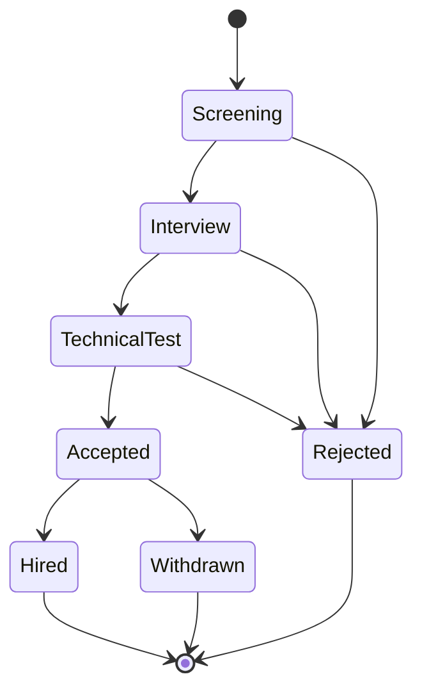
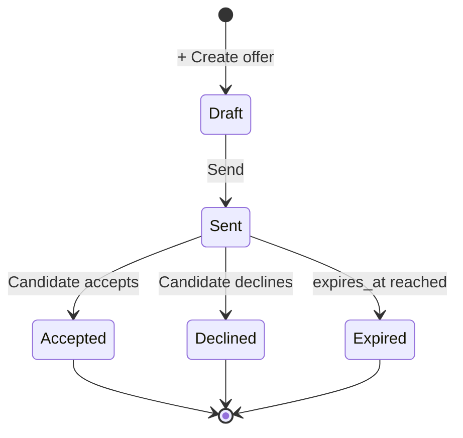

# Recruitment

The hiring pipeline. Open positions, applicants, interviews, offers — with
one-click conversion to an HR employee record.

## Purpose

Recruitment models the full **post-to-hire** funnel.

- **Position** — an open role with budget, headcount, description
- **Applicant** — a candidate against a position, with status progression
- **Interview** — scheduled session (also writes an HR Activity)
- **Offer** — formal letter with salary + terms
- **Conversion** — applicant promoted to employees

## Personas

| Persona | What they do here |
|---|---|
| **Recruiter** | Lives here — posts positions, reviews applicants, schedules interviews |
| **HR Manager** | Approves offers, runs the convert-to-employee step |
| **Hiring Manager** | Reads applicant pipeline for their team, interviews |
| **Auditor** | Verifies hired applicants have linked employee records |

## Quick reference

- **Position status**: `Open`, `On Hold`, `Closed`
- **Applicant status**: `Screening → Interview → Technical Test → Accepted / Rejected → Hired`
- **Offer status**: `Draft → Sent → Accepted / Declined / Expired`
- **Files**: CV / cover letter / portfolio attached as BLOBs to applicant or position
- **Status history**: every change captured in recruitment status history
- **Interview linkage**: each recruitment interviews row spawns an HR activities row

---

=== "Operator's view"

    ### Posting a position

    Recruitment → **Positions** → **+ Add position**.

    | Field | Notes |
    |---|---|
    | Title | "Senior Welder", "Marketing Lead" |
    | Department | FK |
    | Employment type | Full-time / Part-time / Contract |
    | Location | "Beirut Office", "Remote" |
    | Salary range (min / max) | Optional |
    | Headcount | How many people to hire — decrements on each hire |
    | Description, Requirements | Rich text |

    Save. Status → **Open**. posted at timestamped.

    ### Capturing applicants

    From position detail → **+ Add applicant**. Or applicants enter
    themselves via a public form (separate UI).

    | Field | Notes |
    |---|---|
    | Full name, Email, Phone | |
    | Source | "LinkedIn", "Referral", "Walk-in" |
    | Expected salary | |
    | Notes | |
    | CV file | Attach via upload |

    Lands in **Screening**.

    ### Moving through the funnel

    Open applicant → status dropdown → next stage. Every change writes a
    recruitment status history row.

    Typical path:
    `Screening → Interview → Technical Test → Accepted → Hired`

    Rejections branch at any stage with rejected reason.

    ### Scheduling an interview

    From applicant detail → **Schedule interview**.

    - Interviewer (FK to user)
    - Date + time + duration
    - Location
    - Type (Phone / Onsite / Video)

    The system creates both a recruitment interviews row **and** an
    HR activities row for the interviewer's calendar. The two are
    linked via `recruitment_interviews.hr_activity_id`.

    After the interview, mark **Completed** with score + decision +
    notes.

    ### Drafting and sending an offer

    Recruitment → applicant detail → **+ Create offer**.

    All the contract-template fields: title, department, salary, currency,
    benefits, probation, NSSF/EOS toggles, non-compete clauses, …

    **Send** → status `Sent`, sent at timestamped. The candidate has
    until expires at to accept.

    ### Converting to employee

    Once the offer is `Accepted`.

    1. HR Manager opens the applicant
    2. **Convert to employee**
    3. The system atomically: creates employees row + contracts
       row + hire-row in employment history
    4. Updates `recruitment_applicants.converted_employee_id`
    5. Decrements position headcount; closes position if headcount reaches 0

    See [Hiring someone](workflows.md#hiring-someone).

=== "Administrator's view"

    ### Permissions

    | Role | view | create | edit | delete |
    |---|---|---|---|---|
    | Recruiter | ✅ | ✅ | ✅ | ✗ |
    | HR Manager | ✅ | ✅ | ✅ | ✅ |
    | Manager | ✅ (own dept) | ✗ | ✗ | ✗ |

    ### Closing a position

    Auto-closes when headcount reaches 0. Manual close: position → **Close**
    with optional reason. closed at timestamped.

    ### Offer template defaults

    The vendor can configure default values for new offers (probation
    months, annual leave days, notice period) in Settings → Recruitment.

=== "Auditor's view"

    ### Hired applicants should have employee records

    ### Funnel conversion rate

    ### Status history trail

---

## Funnel — applicant status

## Offer status

