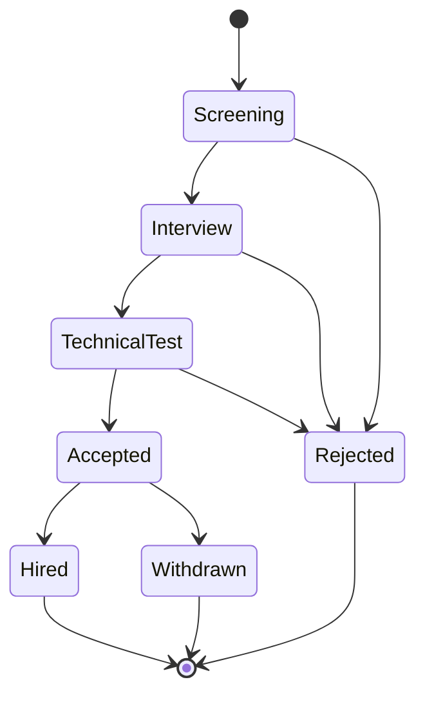
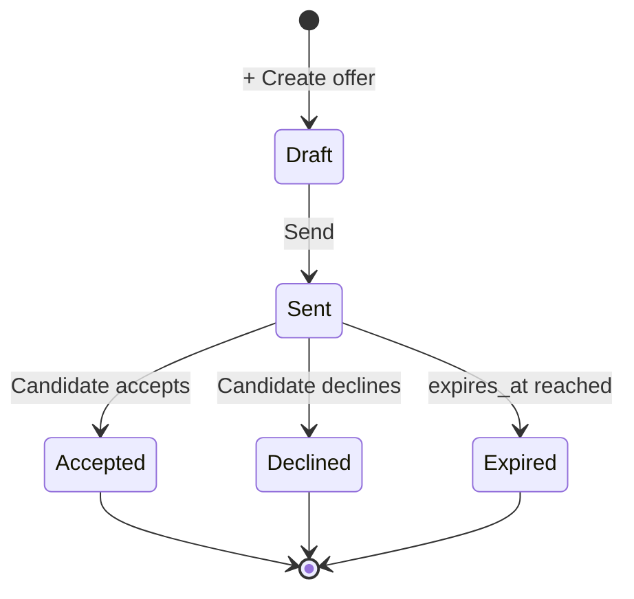
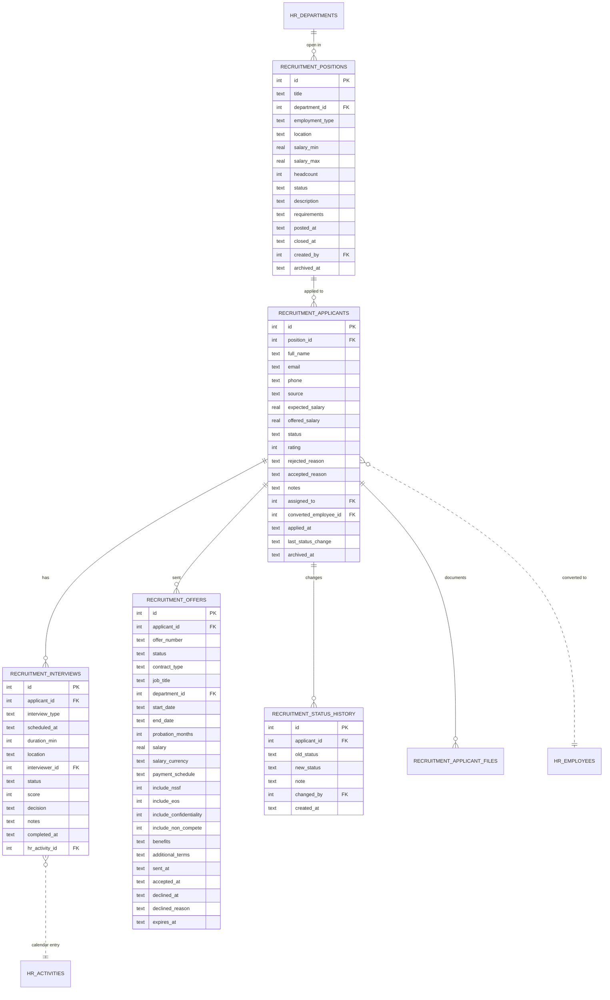

# Recruitment

The hiring pipeline. Open positions, applicants, interviews, offers — with
one-click conversion to an HR employee record.

## Purpose

Recruitment models the full **post-to-hire** funnel:

- **Position** — an open role with budget, headcount, description
- **Applicant** — a candidate against a position, with status progression
- **Interview** — scheduled session (also writes an HR Activity)
- **Offer** — formal letter with salary + terms
- **Conversion** — applicant promoted to `hr_employees`

## Personas

| Persona | What they do here |
|---|---|
| **Recruiter** | Lives here — posts positions, reviews applicants, schedules interviews |
| **HR Manager** | Approves offers, runs the convert-to-employee step |
| **Hiring Manager** | Reads applicant pipeline for their team, interviews |
| **Auditor** | Verifies hired applicants have linked employee records |

## Quick reference

- **Position status**: `Open`, `On Hold`, `Closed`
- **Applicant status**: `Screening → Interview → Technical Test → Accepted / Rejected → Hired`
- **Offer status**: `Draft → Sent → Accepted / Declined / Expired`
- **Files**: CV / cover letter / portfolio attached as BLOBs to applicant or position
- **Status history**: every change captured in `recruitment_status_history`
- **Interview linkage**: each `recruitment_interviews` row spawns an `hr_activities` row

---

=== "Operator's view"

    ### Posting a position

    Recruitment → **Positions** → **+ Add position**:

    | Field | Notes |
    |---|---|
    | Title | "Senior Welder", "Marketing Lead" |
    | Department | FK |
    | Employment type | Full-time / Part-time / Contract |
    | Location | "Beirut Office", "Remote" |
    | Salary range (min / max) | Optional |
    | Headcount | How many people to hire — decrements on each hire |
    | Description, Requirements | Rich text |

    Save. Status → **Open**. `posted_at` timestamped.

    ### Capturing applicants

    From position detail → **+ Add applicant**. Or applicants enter
    themselves via a public form (separate UI):

    | Field | Notes |
    |---|---|
    | Full name, Email, Phone | |
    | Source | "LinkedIn", "Referral", "Walk-in" |
    | Expected salary | |
    | Notes | |
    | CV file | Attach via upload |

    Lands in **Screening**.

    ### Moving through the funnel

    Open applicant → status dropdown → next stage. Every change writes a
    `recruitment_status_history` row.

    Typical path:
    `Screening → Interview → Technical Test → Accepted → Hired`

    Rejections branch at any stage with `rejected_reason`.

    ### Scheduling an interview

    From applicant detail → **Schedule interview**:

    - Interviewer (FK to user)
    - Date + time + duration
    - Location
    - Type (Phone / Onsite / Video)

    The system creates both a `recruitment_interviews` row **and** an
    `hr_activities` row for the interviewer's calendar. The two are
    linked via `recruitment_interviews.hr_activity_id`.

    After the interview, mark **Completed** with score + decision +
    notes.

    ### Drafting and sending an offer

    Recruitment → applicant detail → **+ Create offer**:

    All the contract-template fields: title, department, salary, currency,
    benefits, probation, NSSF/EOS toggles, non-compete clauses, …

    **Send** → status `Sent`, `sent_at` timestamped. The candidate has
    until `expires_at` to accept.

    ### Converting to employee

    Once the offer is `Accepted`:

    1. HR Manager opens the applicant
    2. **Convert to employee**
    3. The system atomically: creates `hr_employees` row + `hr_contracts`
       row + hire-row in `hr_employment_changes`
    4. Updates `recruitment_applicants.converted_employee_id`
    5. Decrements position headcount; closes position if headcount reaches 0

    See [Hire-to-employee workflow](workflows.md#workflow-3-hire-to-employee-conversion).

=== "Administrator's view"

    ### Permissions

    | Role | view | create | edit | delete |
    |---|---|---|---|---|
    | Recruiter | ✅ | ✅ | ✅ | ✗ |
    | HR Manager | ✅ | ✅ | ✅ | ✅ |
    | Manager | ✅ (own dept) | ✗ | ✗ | ✗ |

    ### Closing a position

    Auto-closes when headcount reaches 0. Manual close: position → **Close**
    with optional reason. `closed_at` timestamped.

    ### Offer template defaults

    The vendor can configure default values for new offers (probation
    months, annual leave days, notice period) in Settings → Recruitment.

=== "Auditor's view"

    ### Hired applicants should have employee records

    ```sql
    SELECT a.id, a.full_name, a.status, a.converted_employee_id
    FROM recruitment_applicants a
    WHERE a.status = 'Hired' AND a.converted_employee_id IS NULL;
    -- Expected: zero
    ```

    ### Funnel conversion rate

    ```sql
    SELECT p.title,
           COUNT(a.id) AS applicants,
           SUM(CASE WHEN a.status='Hired' THEN 1 ELSE 0 END) AS hired,
           ROUND(100.0 * SUM(CASE WHEN a.status='Hired' THEN 1 ELSE 0 END)
                       / NULLIF(COUNT(a.id), 0), 1) AS conv_rate_pct
    FROM recruitment_positions p
    LEFT JOIN recruitment_applicants a ON a.position_id = p.id
    WHERE p.archived_at IS NULL
    GROUP BY p.id;
    ```

    ### Status history trail

    ```sql
    SELECT a.full_name, h.old_status, h.new_status, h.note,
           h.created_at, u.username AS changed_by
    FROM recruitment_status_history h
    JOIN recruitment_applicants a ON a.id = h.applicant_id
    LEFT JOIN users u ON u.id = h.changed_by
    WHERE a.id = ? ORDER BY h.created_at;
    ```

---

## Funnel — applicant status



## Offer status



## Data model



## API surface

| Endpoint | Purpose |
|---|---|
| `GET /api/recruitment/positions` | List positions |
| `POST /api/recruitment/positions` | Create |
| `GET /api/recruitment/applicants` | List (filter by position, status) |
| `POST /api/recruitment/applicants` | Create |
| `PATCH /api/recruitment/applicants/{id}/status` | Status transition (writes history) |
| `POST /api/recruitment/applicants/{id}/convert-to-employee` | Hire conversion (see workflows) |
| `POST /api/recruitment/interviews` | Schedule (spawns hr_activity) |
| `POST /api/recruitment/interviews/{id}/complete` | Mark done with score + decision |
| `POST /api/recruitment/offers` | Draft offer |
| `POST /api/recruitment/offers/{id}/send` | Status → Sent |
| `POST /api/recruitment/offers/{id}/accept` | Status → Accepted |
| `POST /api/recruitment/offers/{id}/decline` | Status → Declined with reason |
| `GET /api/recruitment/summary` | Funnel KPIs |
