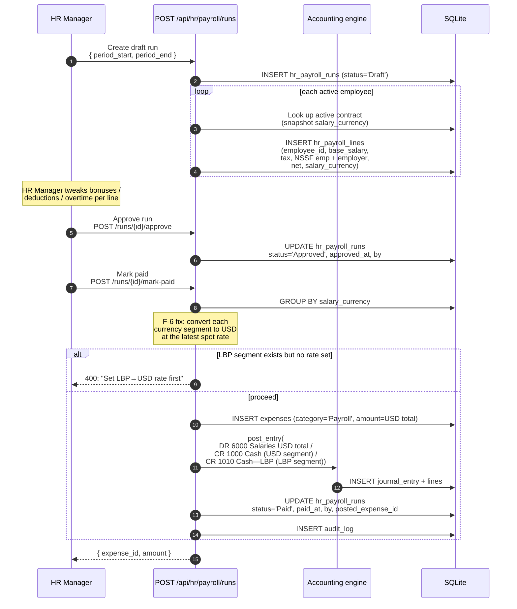
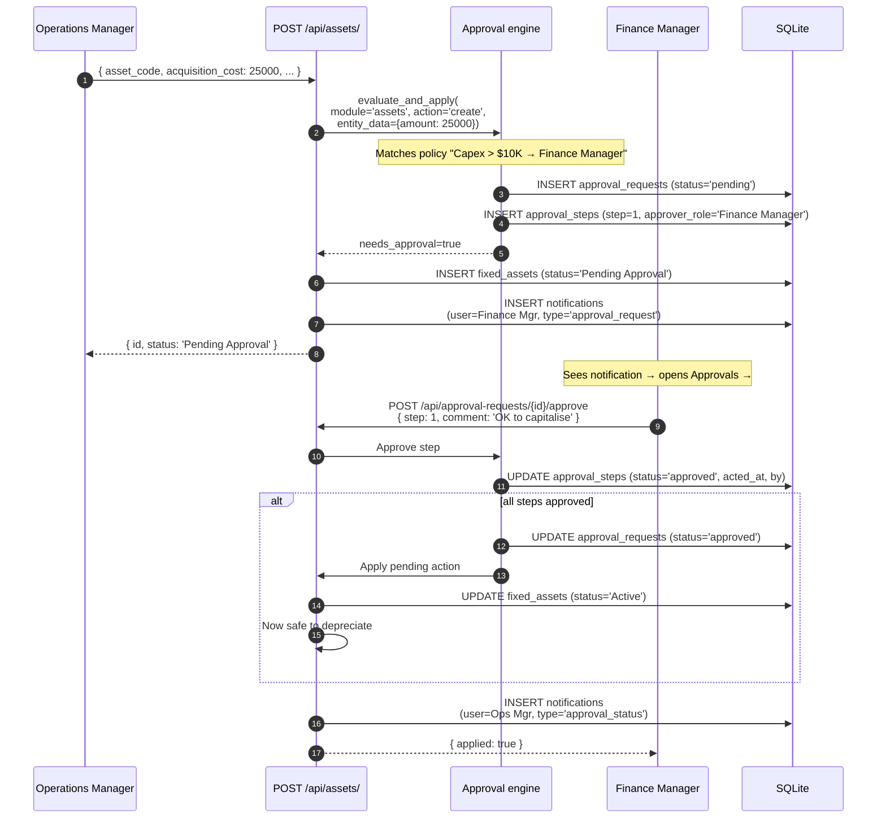
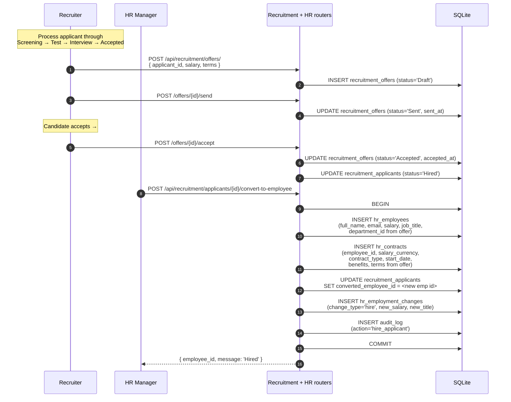

# Headline workflows

Three end-to-end workflows that span this chapter's modules.

## Workflow 1 — Monthly payroll

The F-6 fix is what makes this safe for mixed-currency installs. Every line's
`salary_currency` is snapshotted at run-creation time; mark-paid groups by
currency and converts at the *latest* spot rate.

## Workflow 2 — Capex approval chain

A fixed asset over a threshold needs a Finance Manager sign-off before being
recorded. The approval policy engine handles the chain.

The same engine gates expenses, purchases, invoices, projects, and assets.
The policy specifies which modules + actions + conditions + approver roles.

## Workflow 3 — Hire-to-employee conversion

When a recruitment applicant is hired, the system promotes them to a full
HR employee record.

After conversion, the applicant record stays (audit trail), but the
operational records are now in HR. From there:

- Payroll runs include the new employee
- HR contract carries forward into the next renewal cycle
- The recruitment position's `headcount` decrements
