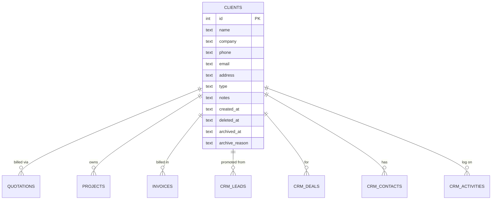
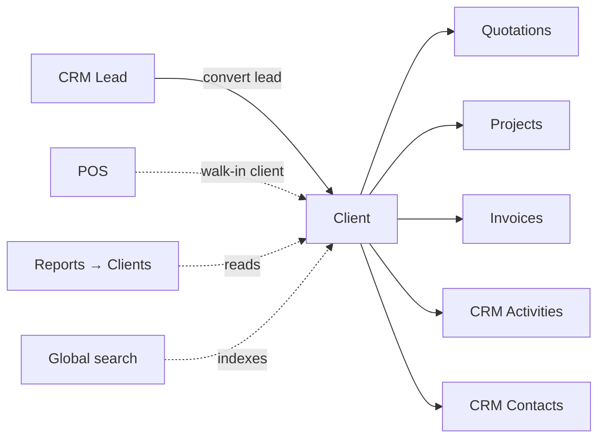

# Clients

The customer master. Every quotation, project, invoice, and CRM record
ultimately points here.

## Purpose

A single, deduplicated record per customer — referenced by every downstream
document. The Client detail view is the **360°** screen: every quote,
project, invoice, payment, and activity for that customer in one place.

## Personas

| Persona | What they do here |
|---|---|
| **Sales rep** | Looks up the customer's history before a call |
| **Accountant** | Opens the client to see outstanding A/R, payment patterns |
| **Sales Manager** | Reviews lifetime value, recent activity, last touch |
| **Administrator** | Adds clients manually, merges duplicates, archives inactive |
| **Auditor** | Tests for duplicates, verifies customer-id integrity across documents |

## Quick reference

- **Type**: `private` (individual) or `company`
- **Created from**: Manual entry, or auto-created from CRM "Convert lead"
- **Required**: `name`. Everything else is optional (`company`, `phone`,
  `email`, `address`, `notes`).
- **Soft delete**: `deleted_at` flag. The Recycle Bin restores it.
- **Soft archive**: `archived_at` flag + `archive_reason`. The Archives
  page restores it.

---

=== "Operator's view"

    ### The clients list

    Sidebar → **Clients**. You see a searchable table of every active client
    (deleted and archived excluded).

    Columns: Name, Company, Type, Phone, Email, **last activity**, **open
    A/R**.

    Click any row to open the **360° detail**.

    ### The 360° detail

    Five tabs:

    1. **Overview** — contact details, recent activities, totals
    2. **Quotations** — every quote ever issued to this client (linked to
       the source quote)
    3. **Projects** — every project for this client (linked back)
    4. **Invoices** — every invoice + payment status (linked back)
    5. **Activities** — CRM activities logged against the client

    ### Adding a client manually

    Clients → **+ Add client** → fill in the form. If the client was already
    created by converting a CRM lead, **don't add another one** — open the
    existing record and edit it.

    ### Updating a client

    Open the detail → **Edit**. Saved changes are audit-logged with
    before/after values.

=== "Administrator's view"

    ### Permissions

    | Role | view | create | edit | delete |
    |---|---|---|---|---|
    | Sales | ✅ | ✅ | ✅ | ✗ |
    | Sales Manager | ✅ | ✅ | ✅ | ✅ |
    | Accountant | ✅ | ✗ | ✗ | ✗ |
    | Project Manager | ✅ | ✗ | ✗ | ✗ |
    | Auditor | ✅ | ✗ | ✗ | ✗ |

    ### Merging duplicates

    The system doesn't have a native "merge clients" action — duplicates
    happen and require a deliberate procedure:

    1. Decide which is the **canonical** record (usually the older one with
       more linked documents)
    2. Re-attach the duplicate's quotations / projects / invoices /
       activities to the canonical id (via direct SQL or via the
       Administrator panel)
    3. Archive the duplicate with `archive_reason="Merged into client #X"`

    !!! warning "Don't hard-delete a client with linked documents"
        FK constraints will reject the delete. The soft-archive path is
        the supported one.

    ### Archiving vs. deleting

    | Action | Effect |
    |---|---|
    | **Archive** | `archived_at` set + `archive_reason`. Hidden from default lists. Documents stay linked. Restorable from Archives. |
    | **Delete** | `deleted_at` set. Hidden from default lists AND from the Archives view. Restorable from Recycle Bin (admin only). |

    Archive for "no longer trading with them"; delete for "shouldn't have
    been created at all".

=== "Auditor's view"

    ### Duplicate detection

    A common control: ensure no client appears twice under slightly different
    names/contacts.

    ```sql
    -- Potential duplicates by company name
    SELECT lower(company) AS norm, COUNT(*) AS c, GROUP_CONCAT(id, ', ') AS ids
    FROM clients
    WHERE deleted_at IS NULL AND archived_at IS NULL AND company IS NOT NULL
    GROUP BY norm HAVING c > 1;

    -- By email
    SELECT lower(email) AS norm, COUNT(*) AS c, GROUP_CONCAT(id, ', ') AS ids
    FROM clients
    WHERE deleted_at IS NULL AND archived_at IS NULL AND email IS NOT NULL
    GROUP BY norm HAVING c > 1;
    ```

    ### Orphan reference check

    Every quotation, project, invoice, and CRM record references a
    `client_id`. None should be orphaned:

    ```sql
    SELECT 'quotations'  AS tbl, COUNT(*) FROM quotations q
      WHERE q.client_id IS NOT NULL
        AND q.client_id NOT IN (SELECT id FROM clients)
    UNION
    SELECT 'projects',    COUNT(*) FROM projects p
      WHERE p.client_id IS NOT NULL
        AND p.client_id NOT IN (SELECT id FROM clients)
    UNION
    SELECT 'invoices',    COUNT(*) FROM invoices i
      WHERE i.client_id IS NOT NULL
        AND i.client_id NOT IN (SELECT id FROM clients);
    ```

    All counts should be zero — FK constraints enforce it at the DB level.

    ### Top customers by A/R

    ```sql
    SELECT c.id, c.name,
           SUM(i.amount) AS billed,
           COALESCE(SUM((SELECT SUM(ip.amount) FROM invoice_payments ip
                          WHERE ip.invoice_id = i.id)), 0) AS paid,
           SUM(i.amount) - COALESCE(SUM((SELECT SUM(ip.amount) FROM invoice_payments ip
                                          WHERE ip.invoice_id = i.id)), 0) AS open_ar
    FROM clients c
    JOIN invoices i ON i.client_id = c.id AND i.deleted_at IS NULL
    GROUP BY c.id, c.name
    ORDER BY open_ar DESC LIMIT 20;
    ```

---

## Data model



## Integrations



## API surface

| Endpoint | Purpose |
|---|---|
| `GET /api/clients/` | List clients (search by name/company/email/phone) |
| `POST /api/clients/` | Create |
| `GET /api/clients/{id}` | Detail + counts |
| `PUT /api/clients/{id}` | Update |
| `DELETE /api/clients/{id}` | Soft-delete (Recycle Bin) |
| `PATCH /api/clients/{id}/archive` | Soft-archive with reason |
| `GET /api/clients/{id}/360` | The full 360° payload (quotes + invoices + projects + activities) |
