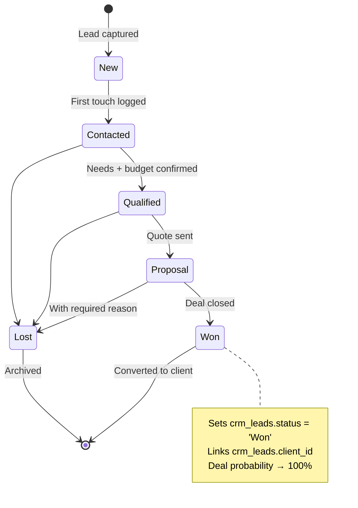

# CRM — Customer Relationship Management

The system's funnel: capture inbound enquiries, qualify them, work them through
stages, win them, and convert into the rest of the sales documents.

## Purpose

CRM holds four kinds of records.

| Record | What it represents |
|---|---|
| **Lead** | A person/company that *might* become a customer |
| **Deal** | A specific opportunity (with a $ value and a probability of close) |
| **Contact** | A named human at a client or lead |
| **Activity** | A call, meeting, email, or task — with due-date and outcome |

A lead becomes a deal becomes a quotation becomes an invoice — each
transition is a single, audited conversion.

## Personas

| Persona | What they do here |
|---|---|
| **Sales rep** | Captures inbound leads, logs every touch, updates stages, marks deals won |
| **Sales Manager** | Watches pipeline value, win rate, sales-cycle length, source attribution |
| **CRM Specialist** | Cleans data, merges duplicate leads, runs reporting |
| **Auditor** | Verifies every won opportunity has an invoice (completeness) |

---

=== "Operator's view"

    ### Capturing a lead

    1. CRM → **Leads** tab → **+ Add lead**
    2. Fill in name, company, contact details, source (referral, website,
       cold-call, …)
    3. Optionally set estimated value and expected close — these are what
       feed pipeline KPIs
    4. Save. The lead lands in status **New**.

    ### Working the funnel

    Each lead has a status that moves left-to-right.

    `New → Contacted → Qualified → Proposal → Won (or Lost)`

    Update via the status dropdown on the lead detail. **Don't skip stages**
    — the funnel report relies on each stage being touched at least once.

    ### Logging activities

    On any lead or deal: **+ Add activity** → pick type (Call / Meeting /
    Email / Task), subject, due date. Mark done at when you complete it
    and add an `outcome` ("Customer wants 10% discount; needs Director
    sign-off").

    Activities surface on the **HR Activities** dashboard for the person
    they're assigned to — handy as a personal to-do list.

    ### Converting a lead

    On a lead detail, top-right menu offers.

    - **Convert to client** — creates a clients row, links it to the lead,
      moves status to "Won"
    - **Create deal** — opens a new deal with the lead's company and
      estimated value pre-filled

    Once the lead has a client, all subsequent quotations and invoices
    can attach to the client (and indirectly back to the originating lead).

    ### Working a deal

    Deals carry stage `Qualification → Proposal → Negotiation → Won (or
    Lost)` plus a **probability %** and a **value**. The pipeline-value
    report sums `value × probability/100` across all open deals.

    Mark won via **Mark won** — sets won at to now. Lost → **Mark lost**
    with a required lost reason (cycle-loss analysis depends on it).

=== "Administrator's view"

    ### Permissions

    The `crm` module has the standard 5 actions. Plus.

    - `Sales` role: `view`, `create`, `edit` (no delete)
    - `Sales Manager`: full, including approve (used for high-value deals
      via approval policies)
    - `CRM Specialist`: full
    - `Auditor`: view only
    - Other roles: typically no access

    ### Lead source taxonomy

    Lead `source` is free-text by design — the install can use whatever
    taxonomy suits. Common values: `referral`, `website`, `cold-call`,
    `event`, `partner`, `repeat`. Run **Reports → Pipeline** to see
    win-rate by source.

    ### Lead scoring

    Each lead carries a `score` (0–100) you can edit manually. There's no
    automatic scoring algorithm — the field is there for sales teams that
    want to bucket leads by quality.

    ### Bulk operations

    The Archives module exposes mass-archive of stale records. Old leads
    that have been "Lost" for > 6 months are good candidates.

=== "Auditor's view"

    ### Completeness check — every won deal has a sales document

    A core control: a won opportunity should result in revenue evidence
    (quotation, invoice, or both). Find gaps.

    Each row needs an explanation: was the work invoiced under a different
    deal? Was it free-of-charge? Was it never invoiced (control gap)?

    ### Cycle time

    ### Source attribution

    ### Activities trail

---

## Status lifecycle

Deals carry their own four-stage timeline — `Qualification → Proposal →
Negotiation → Won`. They overlap with leads on purpose: a lead can spawn
multiple deals over time (re-engagement, upsell, …).

## Permissions

| Action | Default access |
|---|---|
| `view` | Sales, Sales Manager, CRM Specialist, Auditor, Business Owner, Admin |
| `create` | Sales, Sales Manager, CRM Specialist |
| `edit` | Sales (own leads), Sales Manager (all), CRM Specialist |
| `delete` | CRM Specialist, Admin |
| `approve` | Sales Manager (used by high-value deal approval policies) |

Customise in **Roles & Permissions**. Per-warehouse access does not apply to
CRM (no stock motion).
