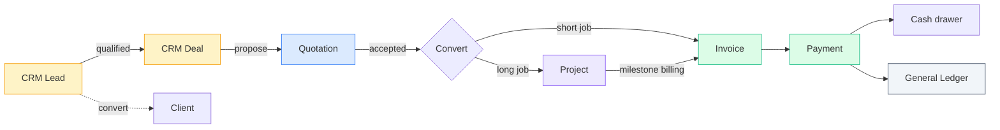

# Sales lifecycle — Quote to Cash

The five modules that turn an inbound enquiry into money in the bank.

| Page | What it covers |
|---|---|
| [Quote-to-cash workflow](quote-to-cash.md) | The end-to-end diagram. Read first. |
| [CRM](crm.md) | Leads → Deals pipeline, contacts, activities |
| [Clients](clients.md) | Customer master + 360° detail view |
| [Quotations](quotations.md) | Proposals, convert to invoice / convert to project |
| [Projects](projects.md) | Long-form work — budget, milestones, material consumption |
| [Invoices & Payments](invoices.md) | Sales billing, multi-currency payments, aging |
| [Sending invoices & quotations](sending.md) | Getting a document to the customer by WhatsApp or email, and seeing whether they opened it |

## The pipeline at a glance

Each box is a separate module page in this chapter. Each arrow is an
explicit, audit-logged conversion.

## Personas you'll meet in this chapter

| Persona | Lives in |
|---|---|
| **Sales rep** | CRM — works leads, books meetings, marks deals won |
| **Sales Manager** | Across the chapter — approves discounts, reviews pipeline |
| **Project Manager** | Projects — runs the long-form work after a quote wins |
| **Accountant / Finance** | Invoices & Payments — chases A/R, applies tenders |
| **Auditor** | Cross-cutting — sample-tests conversions for completeness |
