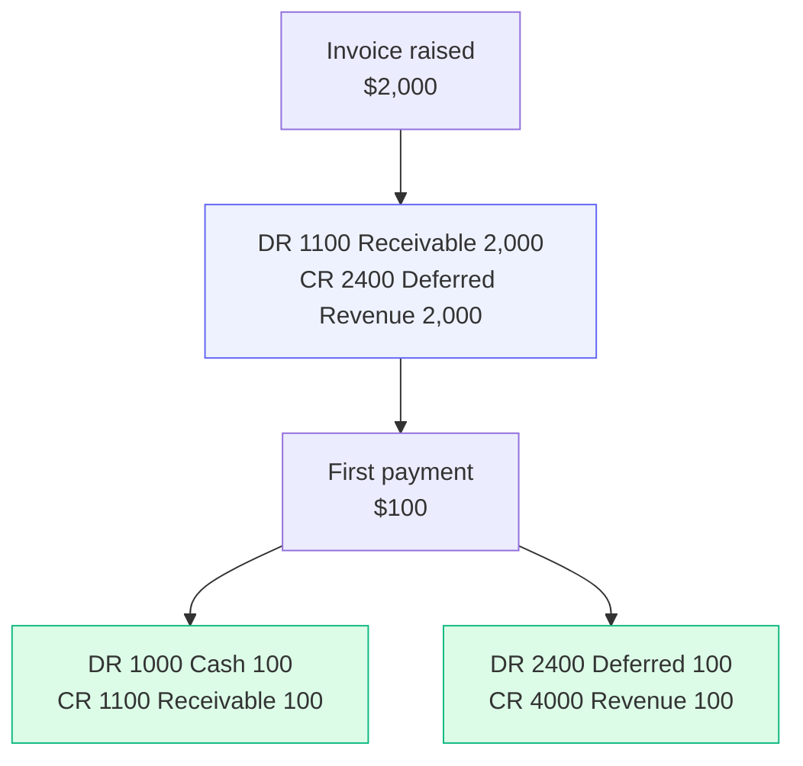
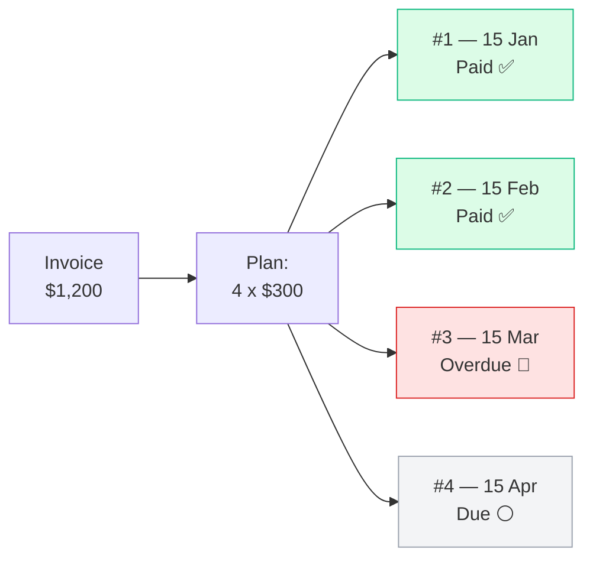
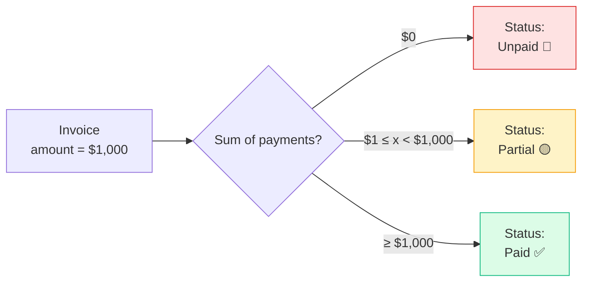

# Invoices & Payments

Billing a customer, and recording what they pay.

## Purpose

An invoice is what you charged. A payment is what you received. They are
kept separate for a simple reason: customers rarely pay all at once.

That separation is what lets you take a deposit now and the balance later,
accept part in USD and part in LBP, and still see exactly what is
outstanding. The status — **Unpaid**, **Partial**, **Paid** — is worked out
from the payments you record. You never set it by hand, so it cannot
disagree with the money.

## Personas

| Persona | What they do here |
|---|---|
| **Accountant** | Issues invoices, applies payments, watches A/R aging |
| **Sales rep** | Reads invoices to know which customers owe what |
| **Cashier** | POS sales auto-create invoice + payment (atomic) |
| **Finance Manager** | Approves voids, runs aging reports |
| **Auditor** | Reconciles invoices ↔ payments ↔ GL entries |

## Quick reference

- **Number format**: vendor-configurable (default `INV-YYYY-NNNN`; POS uses
  `POS-YYYY-NNNN`)
- **Currency**: invoice `amount` is always USD; payments can be USD or LBP
- **Status (computed)**: `Unpaid → Partial → Paid` from sum of payments
- **Void**: mark voided (with void reason) — invoice excluded from
  Finance + VAT + aging
- **Tax**: per-line snapshot (same as quotations)
- **GL posting**: happens on **payment**, not on invoice issue (cash basis)

---

=== "Operator's view"

    ### Creating an invoice

    Three paths.

    | Path | When to use |
    |---|---|
    | **From a quote** → Convert | The customer accepted; bill straight away |
    | **From a project** → New invoice | Milestone billing on long work |
    | **Stand-alone** → Invoices → + Add invoice | One-off charge, no quote/project |

    Fill in line items: name, qty, unit price, optional discount, optional
    tax rate. The `subtotal`, tax total, and `amount` are computed.

    ### Recording a payment

    Open the invoice → **+ Record payment**.

    | Field | Notes |
    |---|---|
    | Amount | In the tender currency |
    | Currency | USD or LBP |
    | Exchange rate | Required for LBP; defaults to the system rate |
    | Method | Cash, Bank Transfer, Card, Cheque, … |
    | Cash drawer | Required for cash payments — the till it lands in |
    | Reference | Cheque #, transfer ID, etc. |
    | Idempotency key | Auto-generated; prevents double-saves on duplicate clicks |

    The invoice's **status badge** updates automatically as soon as you save.

    - `Unpaid` — zero payments
    - `Partial` — sum of payments < amount
    - `Paid` — sum of payments ≥ amount (within $0.001 tolerance)

    ### LBP payment example

    Customer owes $1,000. They hand over LBP 89,000,000 at today's rate
    of 89,000.
    - Amount: `89000000`
    - Currency: `LBP`
    - Exchange rate: `89000` (or leave blank to use the latest stored
      rate)
    - Method: `Cash`

    System computes 89,000,000 ÷ 89,000 = 1,000.00 →
    invoice goes from Unpaid to Paid. The GL posts.

    `DR 1010 Cash — LBP $1,000 / CR 4000 Sales Revenue $1,000`

    Note the cash account is `1010` (LBP cash), not `1000` (USD).

    ### Voiding an invoice

    Open the invoice → **Void** with a required reason. The invoice gets
    void date + void reason; it stays in the database for audit but
    is excluded from finance and VAT reports.

    Cannot void an invoice with payments — refund the payments first.

    ### Sending it to the customer

    **Send** on the row offers WhatsApp and email. The customer gets a link
    to a page showing the same document you print — logo, totals, payment
    history and your bank details.

    See [Sending invoices & quotations](sending.md).

    ### Finding an invoice

    The list shows **one page at a time**, newest first.

    The **search box** searches every invoice, not only the page in front of
    you — it matches the invoice number, quote number, customer, project and
    notes. Clicking a **column heading** sorts the whole list the same way.

    So an old invoice is found by searching, never by scrolling. `Ctrl` + `K`
    from anywhere does the same thing.

    **Export** gives you every invoice matching your current search and
    filters, not just the page on screen.

    ### Getting there from the customer

    **Clients → the customer → Invoices** lists their invoices, and the
    invoice number is a link. Same for quotations.

=== "Administrator's view"

    ### Permissions

    | Role | view | create | edit | delete | approve |
    |---|---|---|---|---|---|
    | Accountant | ✅ | ✅ | ✅ | ✗ | ✗ |
    | Sales | ✅ | ✗ | ✗ | ✗ | ✗ |
    | Finance Manager | ✅ | ✅ | ✅ | ✗ | ✅ |
    | Cashier | ✅ (POS-created only, via POS module) | — | — | — | — |
    | Auditor | ✅ | ✗ | ✗ | ✗ | ✗ |

    `approve` typically gates **void** operations (a void without
    Finance Manager sign-off = control gap).

    ### Numbering — regular vs. POS

    Both pull from the same invoices table, but the **prefix** differs.

    - `INV-` for regular invoices (manual + from quote + from project)
    - `POS-` for POS-checkout invoices

    The split is purely for display — every amount is held in the
    same table with the same lifecycle. POS-prefixed invoices are
    excluded from the regular Invoices list view to keep it scannable
    (POS sales show in the POS module).

    ### Cash drawer attribution

    Cash payments **must** reference a cash drawer id. This is what lets
    the Cash module reconcile drawer balances at end-of-day. If the
    operator doesn't pick a drawer, the system uses the one with
    auto-capture switched on (configured per company).

    ### Exchange rate defaulting

    LBP payments either:
    1. Use the rate the operator supplied
    2. Or fall back to the most recent exchange rate

    If no exchange rate has ever been entered, an LBP payment is rejected
    with a clear error message ("Set the LBP→USD rate in Settings →
    Exchange Rate first"). Configure exchange rates in **Settings →
    Exchange Rate**.

=== "Auditor's view"

    ### A/R = sum of unpaid

    The Trial Balance never shows A/R explicitly (we run cash-basis), but
    you can reconcile against.

    ### Aging buckets

    Available out-of-the-box at **Reports → Invoice Aging**. SQL form.

    ### Payment-to-GL reconciliation

    Every payment posts a journal entry. Verify the chain.

    Each payment writes **two lines**: DR Cash (account `1000` or `1010`
    depending on currency) and CR Revenue (account `4000`).

    ### Void traceability

    Each voided invoice should have a reason and a Finance Manager
    approval recorded in the audit trail.

---

---

---

---

## Your own terms & conditions

**Settings → Document Settings → Invoice terms & conditions.** Whatever you type
there prints at the foot of every invoice — payment terms, retention of title,
a returns policy, whatever your business needs.

It is a multi-line box and the line breaks are kept, so a short list stays a
short list:

```
Payment due within 30 days of invoice date.
Goods remain our property until paid in full.
Returns accepted within 14 days with the original receipt.
```

Set it once and it applies to every invoice from then on, including the PDF you
print and the copy your customer opens from a WhatsApp or email link. Leave it
empty and nothing is printed — no stray heading.

!!! note "Not the same as the closing note"
    **Footer text**, just above it in the same panel, is a single closing line
    that appears on invoices *and* quotations. Terms & conditions are a block,
    and invoices only — a quotation already prints its own validity wording.

---

## What an unpaid invoice does to your books

Raising an invoice records a **receivable** — what the customer owes you. It is
an asset, and it appears on the balance sheet from the moment the invoice is
raised, whether or not anyone has paid.

Because revenue is recognised when the money arrives (see
[Accounting](../finance/accounting.md)), the other side of that receivable is
not income yet. It is held in **2400 Deferred Revenue** and released into
revenue as each payment comes in.



After that first payment on a $2,000 invoice your balance sheet reads:

| | |
|---|---|
| Cash & Bank | $100 |
| Accounts Receivable | $1,900 |
| **Total assets** | **$2,000** |
| Deferred Revenue | $1,900 |

The $1,900 the customer still owes you is now visible in the accounts, not only
on the invoice. Your income statement is unchanged: it still reports the $100
you actually collected.

!!! note "Till sales work differently"
    A POS sale is settled at the counter, so nobody owes anything and no
    receivable is created — it goes straight to cash and revenue.

When an invoice is **voided**, the receivable is reversed with it. Editing an
unpaid invoice's total restates it. Paying an invoice in full leaves both
`1100` and `2400` at zero for that invoice.

---

## Payment plans (instalments)

When a customer agrees to pay over time — a machine settled across twelve
months, a project with a deposit and three stages — record the agreement as a
**payment plan** on the invoice rather than issuing one invoice per month.

Open the invoice's **Payments** window and choose **Set up a plan**. Enter how
many instalments, when the first is due, and whether they fall monthly,
quarterly or yearly. Leave **Deposit** blank to divide the total equally, or
enter it to record money down followed by equal instalments for the rest.



### One invoice, several dates

A plan is a **schedule**, not a set of invoices. The customer keeps one
document, one reference to quote, and one VAT event. Splitting the debt into
twelve invoices would split the revenue and the tax across twelve events and
leave no single record of what was agreed.

The plan always adds up to the invoice total to the cent. Where the division
does not come out evenly — $1,000 over three — the final instalment carries the
remainder ($333.33, $333.33, $333.34), so there is never a last instalment that
cannot be settled.

### Payments settle the oldest instalment first

Record payments exactly as you would on any invoice. Which instalments are
settled is worked out from the invoice's own payments each time it is read: pay
$600 against four instalments of $300 and the first two are settled. Nothing is
stored per instalment, so the plan can never disagree with the invoice balance
shown beside it.

!!! note "A payment cannot be earmarked for a particular month"
    There is no "pay instalment 3" action. Money received is applied to the
    oldest amount still owing, which is the normal rule for an instalment
    agreement and the only one that needs no manual matching.

### Reminders, before and after the date

Each instalment raises its own reminder three days before it falls due, again
on the day, and again once it has passed — naming that instalment, not the
whole balance. Coming up and gone past are deliberately two different alerts:
one is a phone call that usually gets the money in, the other is a debt to
collect, and they are not the same job.

A reminder stops the moment the instalment is covered. Which ones are settled
is worked out from what has been paid, so nothing has to be ticked off.

### Chasing arrears

Each missed instalment raises its own reminder naming that instalment and how
many days late it is — not one reminder for the whole balance. The **Invoice
Aging** report ages a planned invoice by its earliest unpaid instalment and
splits it: the arrears sit in their real bucket while instalments not yet due
stay under *Current*. One missed payment does not make the whole plan overdue.

### What the customer sees

The schedule is printed on the invoice PDF and on the share link they open from
WhatsApp or email — each instalment, what has been paid against it, and what is
still owed, with arrears called out. On an invoice with a plan the usual "full
balance due by …" line is suppressed, because under a plan that date is the
final instalment and the schedule already says what is owed when.

### Changing a plan

A plan can be re-cut or removed freely until the first payment arrives. After
that it is locked: re-cutting twelve instalments into four after three have been
paid would silently re-interpret what the customer has already settled. To
change terms mid-plan, void the invoice and re-issue it.

---

## Status — computed, not stored



The badge on the UI is derived per-request from the total of payments received
against the invoice total. Status is never stored on the invoice — which prevents
the all-too-common bug of a "status" field drifting from the underlying
truth.

## What's NOT supported (deliberately)

- Credit notes as a separate document. Use **Void** (with a reason) +
  re-issue.
- Recurring billing schedules — a *new* invoice raised every month for
  ongoing work. That still relies on the operator issuing each one.
  (A customer paying a *fixed* debt over time is a different thing and is
  supported: see **Payment plans** above.)
- Multi-currency invoice amounts. The amount is always USD; the
  multi-currency layer is at the payment level.
