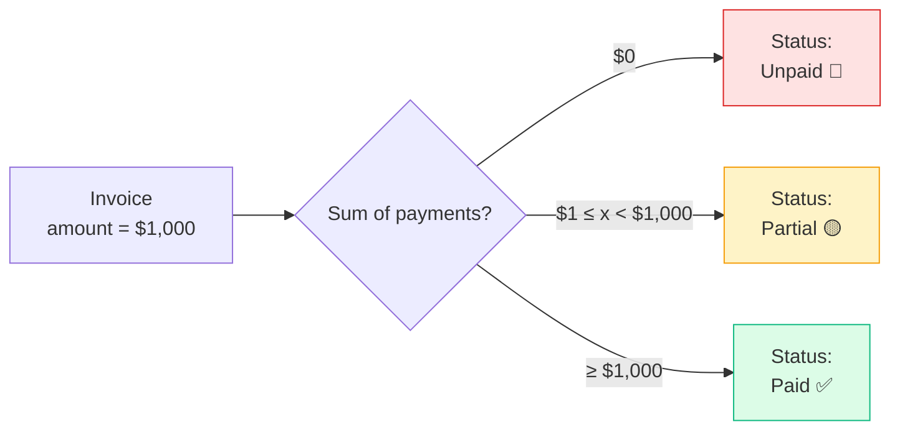
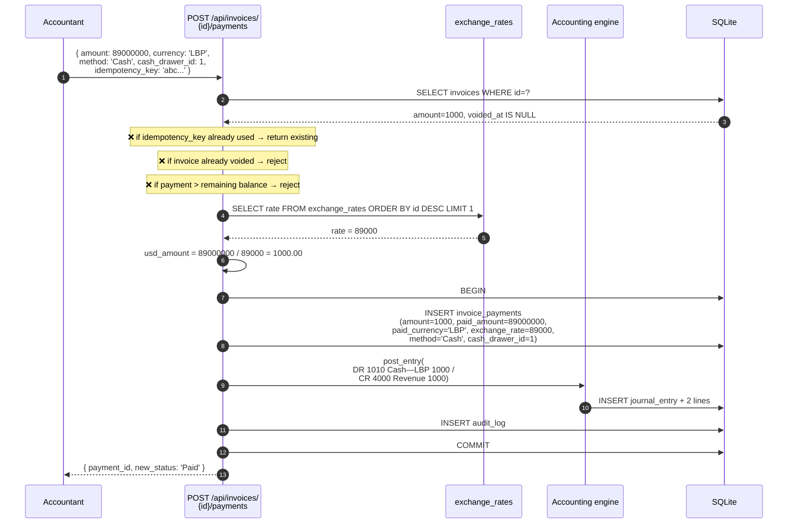
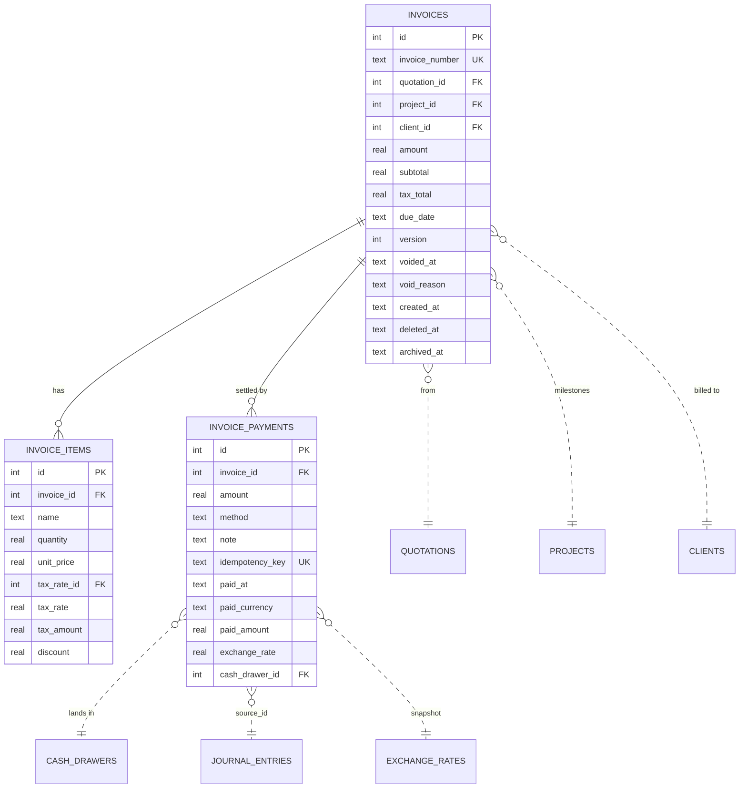
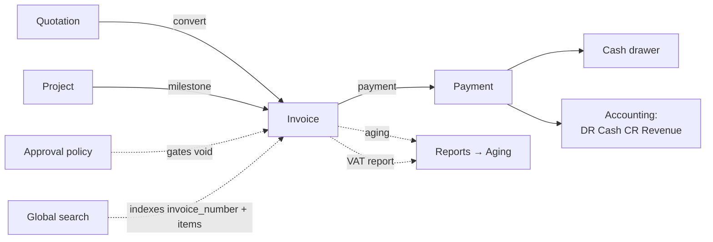

# Invoices & Payments

The billing surface. Where the customer becomes obligated to pay (invoice),
where they pay (payment), and where the books finally recognize revenue
(cash-basis GL post).

## Purpose

Invoices and payments are deliberately **two tables, not one**:

| Table | Records | Why split |
|---|---|---|
| `invoices` | What was billed | One billing event, with line items + tax |
| `invoice_payments` | What was received | Many partial payments possible per invoice; each in its own currency at its own rate |

The split lets the system handle partial payments, multiple tenders, mixed
currencies (LBP + USD against the same invoice) and the cash-basis GL
posting cleanly. The status field on the invoice (`Unpaid / Partial /
Paid`) is **computed** from the sum of payments, never set manually.

## Personas

| Persona | What they do here |
|---|---|
| **Accountant** | Issues invoices, applies payments, watches A/R aging |
| **Sales rep** | Reads invoices to know which customers owe what |
| **Cashier** | POS sales auto-create invoice + payment (atomic) |
| **Finance Manager** | Approves voids, runs aging reports |
| **Auditor** | Reconciles invoices ↔ payments ↔ GL entries |

## Quick reference

- **Number format**: vendor-configurable (default `INV-YYYY-NNNN`; POS uses
  `POS-YYYY-NNNN`)
- **Currency**: invoice `amount` is always USD; payments can be USD or LBP
- **Status (computed)**: `Unpaid → Partial → Paid` from sum of payments
- **Void**: mark voided (with `void_reason`) — invoice excluded from
  Finance + VAT + aging
- **Tax**: per-line snapshot (same as quotations)
- **GL posting**: happens on **payment**, not on invoice issue (cash basis)

---

=== "Operator's view"

    ### Creating an invoice

    Three paths:

    | Path | When to use |
    |---|---|
    | **From a quote** → Convert | The customer accepted; bill straight away |
    | **From a project** → New invoice | Milestone billing on long work |
    | **Stand-alone** → Invoices → + Add invoice | One-off charge, no quote/project |

    Fill in line items: name, qty, unit price, optional discount, optional
    tax rate. The `subtotal`, `tax_total`, and `amount` are computed.

    ### Recording a payment

    Open the invoice → **+ Record payment**:

    | Field | Notes |
    |---|---|
    | Amount | In the tender currency |
    | Currency | USD or LBP |
    | Exchange rate | Required for LBP; defaults to the system rate |
    | Method | Cash, Bank Transfer, Card, Cheque, … |
    | Cash drawer | Required for cash payments — the till it lands in |
    | Reference | Cheque #, transfer ID, etc. |
    | Idempotency key | Auto-generated; prevents double-saves on duplicate clicks |

    The invoice's **status badge** updates automatically as soon as you save:

    - `Unpaid` — zero payments
    - `Partial` — sum of payments < amount
    - `Paid` — sum of payments ≥ amount (within $0.001 tolerance)

    ### LBP payment example

    Customer owes $1,000. They hand over LBP 89,000,000 at today's rate
    of 89,000.
    - Amount: `89000000`
    - Currency: `LBP`
    - Exchange rate: `89000` (or leave blank to use the latest stored
      rate)
    - Method: `Cash`

    System computes `usd_amount = 89,000,000 / 89,000 = 1,000.00` →
    invoice goes from Unpaid to Paid. The GL posts:

    `DR 1010 Cash — LBP $1,000 / CR 4000 Sales Revenue $1,000`

    Note the cash account is `1010` (LBP cash), not `1000` (USD).

    ### Voiding an invoice

    Open the invoice → **Void** with a required reason. The invoice gets
    `voided_at` + `void_reason`; it stays in the database for audit but
    is excluded from finance and VAT reports.

    Cannot void an invoice with payments — refund the payments first.

=== "Administrator's view"

    ### Permissions

    | Role | view | create | edit | delete | approve |
    |---|---|---|---|---|---|
    | Accountant | ✅ | ✅ | ✅ | ✗ | ✗ |
    | Sales | ✅ | ✗ | ✗ | ✗ | ✗ |
    | Finance Manager | ✅ | ✅ | ✅ | ✗ | ✅ |
    | Cashier | ✅ (POS-created only, via POS module) | — | — | — | — |
    | Auditor | ✅ | ✗ | ✗ | ✗ | ✗ |

    `approve` typically gates **void** operations (a void without
    Finance Manager sign-off = control gap).

    ### Numbering — regular vs. POS

    Both pull from the same `invoices` table, but the **prefix** differs:

    - `INV-` for regular invoices (manual + from quote + from project)
    - `POS-` for POS-checkout invoices

    The split is purely cosmetic — under the hood every row is in the
    same table with the same lifecycle. POS-prefixed invoices are
    excluded from the regular Invoices list view to keep it scannable
    (POS sales show in the POS module).

    ### Cash drawer attribution

    Cash payments **must** reference a `cash_drawer_id`. This is what lets
    the Cash module reconcile drawer balances at end-of-day. If the
    operator doesn't pick a drawer, the system uses the one with
    `auto_capture=1` (configured per company).

    ### Exchange rate defaulting

    LBP payments either:
    1. Use the rate the operator supplied
    2. Or fall back to the latest row in `exchange_rates`

    If no exchange rate has ever been entered, an LBP payment is rejected
    with a clear error message ("Set the LBP→USD rate in Settings →
    Exchange Rate first"). Configure exchange rates in **Settings →
    Exchange Rate**.

=== "Auditor's view"

    ### A/R = sum of unpaid

    The Trial Balance never shows A/R explicitly (we run cash-basis), but
    you can reconcile against:

    ```sql
    SELECT
      SUM(i.amount) AS total_billed,
      COALESCE(SUM(p.paid), 0) AS total_received,
      SUM(i.amount) - COALESCE(SUM(p.paid), 0) AS open_ar
    FROM invoices i
    LEFT JOIN (
      SELECT invoice_id, SUM(amount) AS paid
      FROM invoice_payments GROUP BY invoice_id
    ) p ON p.invoice_id = i.id
    WHERE i.deleted_at IS NULL AND i.voided_at IS NULL;
    ```

    ### Aging buckets

    Available out-of-the-box at **Reports → Invoice Aging**. SQL form:

    ```sql
    SELECT
      CASE
        WHEN julianday('now') - julianday(i.due_date) <= 0 THEN 'Current'
        WHEN julianday('now') - julianday(i.due_date) <= 30 THEN '1-30 days'
        WHEN julianday('now') - julianday(i.due_date) <= 60 THEN '31-60 days'
        WHEN julianday('now') - julianday(i.due_date) <= 90 THEN '61-90 days'
        ELSE '90+ days'
      END AS bucket,
      SUM(i.amount - COALESCE(p.paid, 0)) AS open_ar,
      COUNT(*) AS invoices
    FROM invoices i
    LEFT JOIN (SELECT invoice_id, SUM(amount) AS paid
               FROM invoice_payments GROUP BY invoice_id) p
      ON p.invoice_id = i.id
    WHERE i.deleted_at IS NULL AND i.voided_at IS NULL
      AND (i.amount - COALESCE(p.paid, 0)) > 0.01
    GROUP BY bucket;
    ```

    ### Payment-to-GL reconciliation

    Every payment posts a journal entry. Verify the chain:

    ```sql
    -- For a specific payment, the matching journal entry
    SELECT ip.id AS payment_id, ip.amount, ip.paid_currency,
           je.entry_number, je.entry_date,
           jel.debit, jel.credit, a.code, a.name
    FROM invoice_payments ip
    JOIN journal_entries je
      ON je.source_type = 'invoice_payment' AND je.source_id = ip.id
    JOIN journal_entry_lines jel ON jel.journal_entry_id = je.id
    JOIN chart_of_accounts a ON a.id = jel.account_id
    WHERE ip.id = ?;
    ```

    Each payment writes **two lines**: DR Cash (account `1000` or `1010`
    depending on currency) and CR Revenue (account `4000`).

    ### Void traceability

    ```sql
    SELECT i.invoice_number, i.amount, i.voided_at, i.void_reason,
           u.username AS voided_by
    FROM invoices i
    LEFT JOIN audit_log a
      ON a.module='invoices' AND a.action='void' AND a.record_id=i.id
    LEFT JOIN users u ON u.id = a.user_id
    WHERE i.voided_at IS NOT NULL
    ORDER BY i.voided_at DESC;
    ```

    Each voided invoice should have a reason and a Finance Manager
    approval audit row.

---

## Status — computed, not stored



The badge on the UI is derived per-request from `SUM(invoice_payments.amount)`
vs. `invoices.amount`. There is no `invoices.status` column — preventing
the all-too-common bug of a "status" field drifting from the underlying
truth.

## Workflow — record an LBP payment



Note the cash account selected: **`1010 Cash — LBP`**, not `1000 Cash &
Bank`. This is the F-5 audit fix from the multi-currency remediation —
LBP cash accumulates on its own ledger account so it can be revalued at
period close.

## Data model



`amount` on `invoice_payments` is **always USD** (the applied value).
`paid_amount` is what the customer actually handed over in
`paid_currency`. For USD payments they're equal; for LBP they differ by
`exchange_rate`.

## Integrations



## API surface

| Endpoint | Purpose |
|---|---|
| `GET /api/invoices/` | List (filter by status, client, date) |
| `POST /api/invoices/` | Create (with line items) |
| `GET /api/invoices/{id}` | Detail + payments + computed status |
| `PUT /api/invoices/{id}` | Edit header + items (until first payment) |
| `POST /api/invoices/{id}/payments` | Record payment |
| `DELETE /api/invoices/{id}/payments/{pid}` | Reverse payment (recorded by mistake) |
| `POST /api/invoices/{id}/void` | Void with reason |
| `POST /api/invoices/{id}/render-pdf` | Server-side PDF |
| `DELETE /api/invoices/{id}` | Soft-delete |
| `PATCH /api/invoices/{id}/archive` | Soft-archive |

## What's NOT supported (deliberately)

- Credit notes as a separate document. Use **Void** (with a reason) +
  re-issue.
- Recurring billing schedules. Use **Recurring Expenses** template
  pattern but for the receiving side, where the customer pays on a
  schedule, the system relies on the operator to issue each invoice.
- Multi-currency invoice amounts. The amount is always USD; the
  multi-currency layer is at the payment level.
