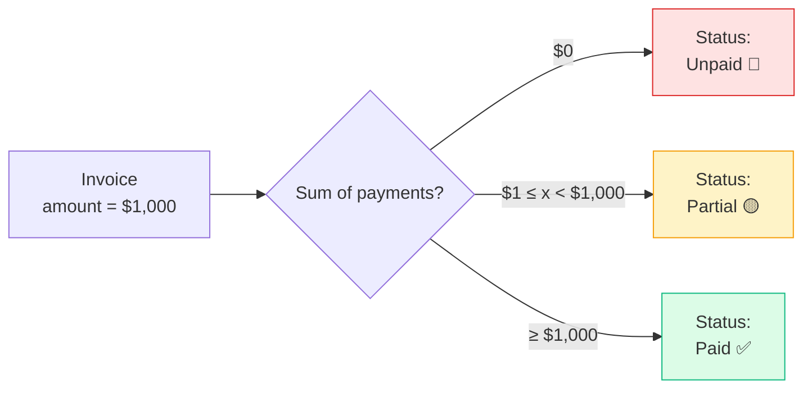

# Invoices & Payments

Billing a customer, and recording what they pay.

## Purpose

An invoice is what you charged. A payment is what you received. They are
kept separate for a simple reason: customers rarely pay all at once.

That separation is what lets you take a deposit now and the balance later,
accept part in USD and part in LBP, and still see exactly what is
outstanding. The status — **Unpaid**, **Partial**, **Paid** — is worked out
from the payments you record. You never set it by hand, so it cannot
disagree with the money.

## Personas

| Persona | What they do here |
|---|---|
| **Accountant** | Issues invoices, applies payments, watches A/R aging |
| **Sales rep** | Reads invoices to know which customers owe what |
| **Cashier** | POS sales auto-create invoice + payment (atomic) |
| **Finance Manager** | Approves voids, runs aging reports |
| **Auditor** | Reconciles invoices ↔ payments ↔ GL entries |

## Quick reference

- **Number format**: vendor-configurable (default `INV-YYYY-NNNN`; POS uses
  `POS-YYYY-NNNN`)
- **Currency**: invoice `amount` is always USD; payments can be USD or LBP
- **Status (computed)**: `Unpaid → Partial → Paid` from sum of payments
- **Void**: mark voided (with void reason) — invoice excluded from
  Finance + VAT + aging
- **Tax**: per-line snapshot (same as quotations)
- **GL posting**: happens on **payment**, not on invoice issue (cash basis)

---

=== "Operator's view"

    ### Creating an invoice

    Three paths.

    | Path | When to use |
    |---|---|
    | **From a quote** → Convert | The customer accepted; bill straight away |
    | **From a project** → New invoice | Milestone billing on long work |
    | **Stand-alone** → Invoices → + Add invoice | One-off charge, no quote/project |

    Fill in line items: name, qty, unit price, optional discount, optional
    tax rate. The `subtotal`, tax total, and `amount` are computed.

    ### Recording a payment

    Open the invoice → **+ Record payment**.

    | Field | Notes |
    |---|---|
    | Amount | In the tender currency |
    | Currency | USD or LBP |
    | Exchange rate | Required for LBP; defaults to the system rate |
    | Method | Cash, Bank Transfer, Card, Cheque, … |
    | Cash drawer | Required for cash payments — the till it lands in |
    | Reference | Cheque #, transfer ID, etc. |
    | Idempotency key | Auto-generated; prevents double-saves on duplicate clicks |

    The invoice's **status badge** updates automatically as soon as you save.

    - `Unpaid` — zero payments
    - `Partial` — sum of payments < amount
    - `Paid` — sum of payments ≥ amount (within $0.001 tolerance)

    ### LBP payment example

    Customer owes $1,000. They hand over LBP 89,000,000 at today's rate
    of 89,000.
    - Amount: `89000000`
    - Currency: `LBP`
    - Exchange rate: `89000` (or leave blank to use the latest stored
      rate)
    - Method: `Cash`

    System computes 89,000,000 ÷ 89,000 = 1,000.00 →
    invoice goes from Unpaid to Paid. The GL posts.

    `DR 1010 Cash — LBP $1,000 / CR 4000 Sales Revenue $1,000`

    Note the cash account is `1010` (LBP cash), not `1000` (USD).

    ### Voiding an invoice

    Open the invoice → **Void** with a required reason. The invoice gets
    void date + void reason; it stays in the database for audit but
    is excluded from finance and VAT reports.

    Cannot void an invoice with payments — refund the payments first.

    ### Sending it to the customer

    **Send** on the row offers WhatsApp and email. The customer gets a link
    to a page showing the same document you print — logo, totals, payment
    history and your bank details.

    See [Sending invoices & quotations](sending.md).

    ### Finding an invoice

    The list shows **one page at a time**, newest first.

    The **search box** searches every invoice, not only the page in front of
    you — it matches the invoice number, quote number, customer, project and
    notes. Clicking a **column heading** sorts the whole list the same way.

    So an old invoice is found by searching, never by scrolling. `Ctrl` + `K`
    from anywhere does the same thing.

    **Export** gives you every invoice matching your current search and
    filters, not just the page on screen.

    ### Getting there from the customer

    **Clients → the customer → Invoices** lists their invoices, and the
    invoice number is a link. Same for quotations.

=== "Administrator's view"

    ### Permissions

    | Role | view | create | edit | delete | approve |
    |---|---|---|---|---|---|
    | Accountant | ✅ | ✅ | ✅ | ✗ | ✗ |
    | Sales | ✅ | ✗ | ✗ | ✗ | ✗ |
    | Finance Manager | ✅ | ✅ | ✅ | ✗ | ✅ |
    | Cashier | ✅ (POS-created only, via POS module) | — | — | — | — |
    | Auditor | ✅ | ✗ | ✗ | ✗ | ✗ |

    `approve` typically gates **void** operations (a void without
    Finance Manager sign-off = control gap).

    ### Numbering — regular vs. POS

    Both pull from the same invoices table, but the **prefix** differs.

    - `INV-` for regular invoices (manual + from quote + from project)
    - `POS-` for POS-checkout invoices

    The split is purely for display — every amount is held in the
    same table with the same lifecycle. POS-prefixed invoices are
    excluded from the regular Invoices list view to keep it scannable
    (POS sales show in the POS module).

    ### Cash drawer attribution

    Cash payments **must** reference a cash drawer id. This is what lets
    the Cash module reconcile drawer balances at end-of-day. If the
    operator doesn't pick a drawer, the system uses the one with
    auto-capture switched on (configured per company).

    ### Exchange rate defaulting

    LBP payments either:
    1. Use the rate the operator supplied
    2. Or fall back to the most recent exchange rate

    If no exchange rate has ever been entered, an LBP payment is rejected
    with a clear error message ("Set the LBP→USD rate in Settings →
    Exchange Rate first"). Configure exchange rates in **Settings →
    Exchange Rate**.

=== "Auditor's view"

    ### A/R = sum of unpaid

    The Trial Balance never shows A/R explicitly (we run cash-basis), but
    you can reconcile against.

    ### Aging buckets

    Available out-of-the-box at **Reports → Invoice Aging**. SQL form.

    ### Payment-to-GL reconciliation

    Every payment posts a journal entry. Verify the chain.

    Each payment writes **two lines**: DR Cash (account `1000` or `1010`
    depending on currency) and CR Revenue (account `4000`).

    ### Void traceability

    Each voided invoice should have a reason and a Finance Manager
    approval recorded in the audit trail.

---

## Status — computed, not stored

The badge on the UI is derived per-request from the total of payments received
against the invoice total. Status is never stored on the invoice — which prevents
the all-too-common bug of a "status" field drifting from the underlying
truth.

## What's NOT supported (deliberately)

- Credit notes as a separate document. Use **Void** (with a reason) +
  re-issue.
- Recurring billing schedules. Use **Recurring Expenses** template
  pattern but for the receiving side, where the customer pays on a
  schedule, the system relies on the operator to issue each invoice.
- Multi-currency invoice amounts. The amount is always USD; the
  multi-currency layer is at the payment level.
