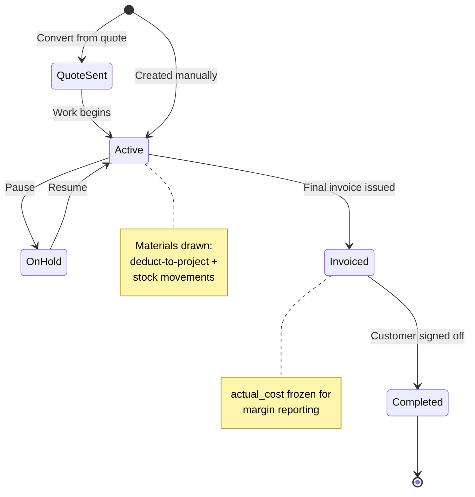
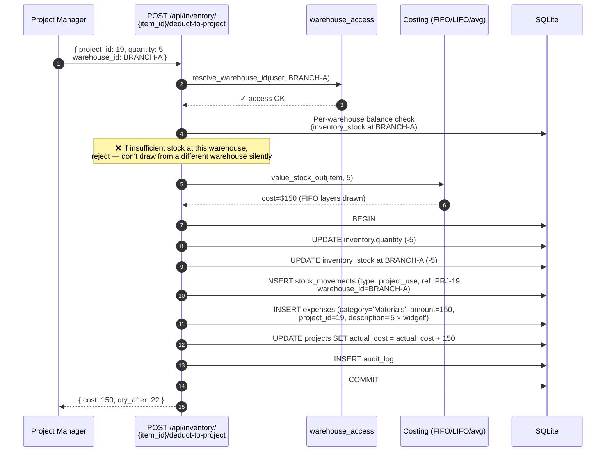
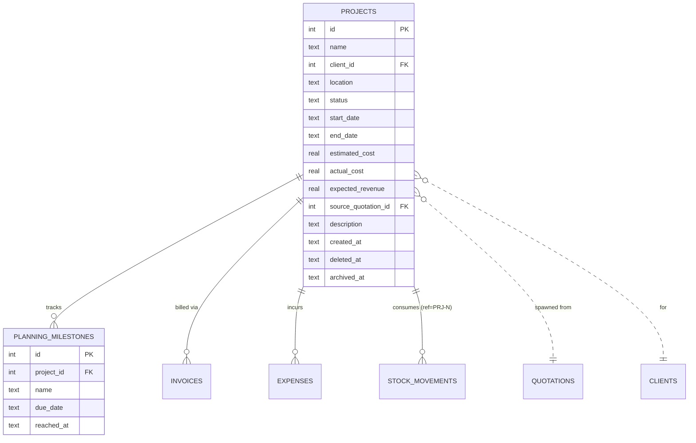
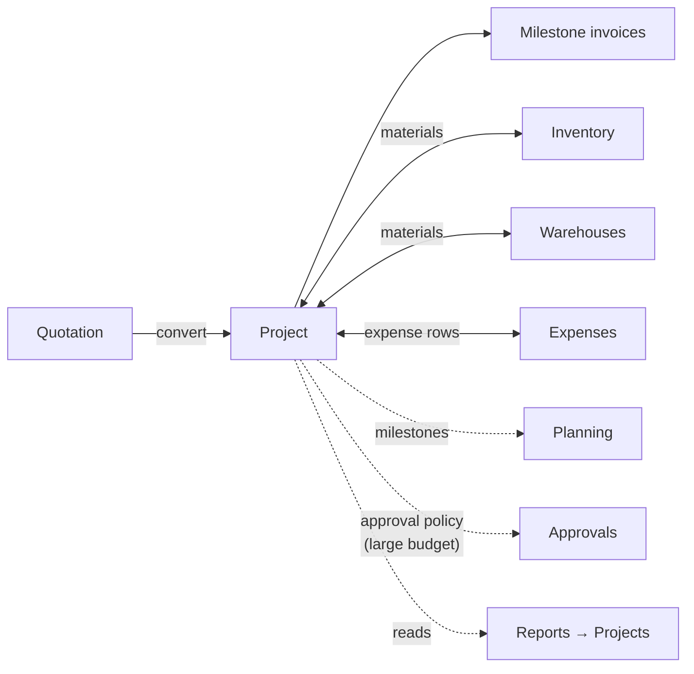

# Projects

The long-form-work container. When a quotation wins and the delivery spans
weeks or months, the work lives here — with a budget, milestones, material
consumption, and progressive invoicing.

## Purpose

A project is the **work order** of the system. It carries:

- The **commercial promise** (`expected_revenue` — what the customer pays)
- The **operational promise** (line items, location, dates)
- The **actual cost** as it accumulates (`actual_cost` — materials + labour
  + sub-contracts)
- The **billing trail** (one project, many invoices over time)

A 30-day construction job, a 6-month consulting engagement, or a year-long
maintenance contract — all fit this model.

## Personas

| Persona | What they do here |
|---|---|
| **Project Manager** | Lives in this module — runs the work, books materials, marks milestones |
| **Foreman / Field tech** | Uses inventory deduct-to-project to draw materials |
| **Accountant** | Issues milestone invoices, reads budget vs. actual |
| **Sales Manager** | Reviews margin (`expected_revenue - actual_cost`) per project |
| **Auditor** | Verifies material consumption matches stock movements |

## Quick reference

- **Status lifecycle**: `Quotation Sent → Active → Invoiced → Completed`
  (or paused: `On Hold`)
- **Created from**: usually `Convert quotation to project`, sometimes manual
- **Soft delete + soft archive**: same pattern as other entities
- **Linked entities**: client, source quotation, milestones, expenses,
  invoices, material consumption (via inventory deduct-to-project)

---

=== "Operator's view"

    ### Project list

    Sidebar → **Projects**. Columns: Name, Client, Status, Start, End,
    Estimated cost, Actual cost, **margin**.

    Filter by status to see "what's running right now".

    ### Project detail — six tabs

    1. **Overview** — budget, dates, location, description, **margin
       indicator**
    2. **Milestones** — planning_milestones rows with due-date and
       reached-at
    3. **Quotations** — quotes linked to this project (typically the
       source quote)
    4. **Invoices** — every invoice billed against this project
    5. **Expenses** — every expense charged to the project
    6. **Materials** — every stock deduction performed via "Deduct to
       project"

    ### Running a project

    | Operation | Where |
    |---|---|
    | Mark a milestone reached | Project → Milestones → click reached date |
    | Book material consumption | **Inventory → Deduct to project** (warehouse picker now appears, see Phase 1 Foundation → Multi-warehouse access) |
    | Add an expense | **Expenses → + Add expense** with this project picked |
    | Bill a milestone | **+ New invoice from this project** (top right) |
    | Mark completed | Status dropdown → Completed |

    ### Budget vs. actual

    The Overview tab shows three numbers:

    | Field | Source |
    |---|---|
    | Expected revenue | `expected_revenue` (from accepted quote) |
    | Estimated cost | `estimated_cost` (your budget at start) |
    | Actual cost | Sum of expenses + materials valued at unit cost |

    The **margin indicator** turns red when `actual_cost > estimated_cost`.

=== "Administrator's view"

    ### Permissions

    | Role | view | create | edit | delete | approve |
    |---|---|---|---|---|---|
    | Project Manager | ✅ | ✅ | ✅ | ✗ | ✗ |
    | Sales | ✅ | ✗ | ✗ | ✗ | ✗ |
    | Accountant | ✅ | ✗ | ✗ | ✗ | ✗ |
    | Auditor | ✅ | ✗ | ✗ | ✗ | ✗ |
    | Sales Manager | ✅ | ✅ | ✅ | ✅ | ✅ |

    `approve` is used by approval policies on large projects (e.g.
    estimated cost > $50,000 requires Operations Manager approval before
    materials can be drawn).

    ### Project status transitions

    The status field is free-text-ish but the values matter for reports:

    | Status | When |
    |---|---|
    | `Quotation Sent` | Auto-set when created from a Sent quote |
    | `Active` | Work is happening; default after acceptance |
    | `On Hold` | Pause without closing — surfaces in "Stalled projects" report |
    | `Invoiced` | Final invoice issued, work mostly done |
    | `Completed` | Final settlement done; archived shortly after |

    ### Material consumption controls

    "Deduct to project" is the **only** controlled path to charge materials.
    It writes:
    - `expenses` row with `category='Materials'`, `project_id=<this>`
    - `stock_movements` row with `type='project_use'`, `warehouse_id=<resolved>`
    - `inventory.quantity` decrement (company-wide)
    - `inventory_stock.quantity` decrement (per-warehouse)
    - `inventory_cost_layers` draw-down (FIFO/LIFO/avg per costing method)

    All five writes in a single transaction. See Audit trail for proof.

=== "Auditor's view"

    ### Budget overruns

    ```sql
    -- Projects > 20% over budget, still open
    SELECT p.id, p.name, c.name AS client,
           p.estimated_cost, p.actual_cost,
           ROUND(100.0 * (p.actual_cost - p.estimated_cost)
                       / NULLIF(p.estimated_cost, 0), 1) AS overrun_pct
    FROM projects p JOIN clients c ON c.id = p.client_id
    WHERE p.deleted_at IS NULL
      AND p.status IN ('Active', 'On Hold')
      AND p.actual_cost > p.estimated_cost * 1.2
    ORDER BY overrun_pct DESC;
    ```

    Each should have either a margin discussion, a scope-change quote, or
    a write-down decision.

    ### Material-flow reconciliation

    Every project material draw should match a stock movement:

    ```sql
    -- Expenses tagged "Materials" against a project, with the matching
    -- stock movements grouped by date.
    SELECT p.id AS project_id, p.name,
           SUM(e.amount) AS expenses_materials,
           SUM(sm.qty_before - sm.qty_after) AS units_drawn
    FROM projects p
    LEFT JOIN expenses e ON e.project_id = p.id AND e.category = 'Materials'
    LEFT JOIN stock_movements sm
      ON sm.reference = 'PRJ-' || p.id AND sm.type = 'project_use'
    WHERE p.deleted_at IS NULL
    GROUP BY p.id, p.name;
    ```

    The numbers won't be equal (one is $, one is units) but **every
    project with non-zero `expenses_materials` should have non-zero
    stock movements** (and vice versa).

    ### Revenue vs. cost margin per project

    ```sql
    SELECT p.id, p.name,
           p.expected_revenue AS quoted,
           COALESCE(SUM(i.amount), 0) AS invoiced,
           p.actual_cost,
           p.expected_revenue - p.actual_cost AS planned_margin,
           COALESCE(SUM(i.amount), 0) - p.actual_cost AS realised_margin
    FROM projects p
    LEFT JOIN invoices i ON i.project_id = p.id AND i.deleted_at IS NULL
    WHERE p.deleted_at IS NULL
    GROUP BY p.id, p.name
    ORDER BY realised_margin;
    ```

---

## Status lifecycle



## Workflow — deduct material to project



Five tables updated in one transaction. The project's `actual_cost`
ticks up, the stock comes off the right warehouse, costing follows the
method.

## Data model



## Integrations



## API surface

| Endpoint | Purpose |
|---|---|
| `GET /api/projects/` | List (filter by status, client, date) |
| `POST /api/projects/` | Create manually |
| `GET /api/projects/{id}` | Detail (all six tabs in one payload) |
| `PUT /api/projects/{id}` | Update |
| `PATCH /api/projects/{id}/status` | Status transition (audited) |
| `POST /api/projects/{id}/milestones` | Add milestone |
| `PATCH /api/projects/{id}/milestones/{mid}/reach` | Mark reached |
| `POST /api/inventory/{item_id}/deduct-to-project` | Material draw (the controlled path) |
| `DELETE /api/projects/{id}` | Soft-delete |
| `PATCH /api/projects/{id}/archive` | Soft-archive |

## What's NOT supported (deliberately)

- Per-line-item project billing tied to specific quote lines. Invoices
  attached to a project are free-form line items — you describe what
  you're billing this period.
- Time tracking. The system doesn't track hours-by-person against a
  project. If you need it, log it as Expenses with `category='Labour'`.
- Sub-projects. Projects don't nest. A long programme breaks into
  separate projects with a shared client.
