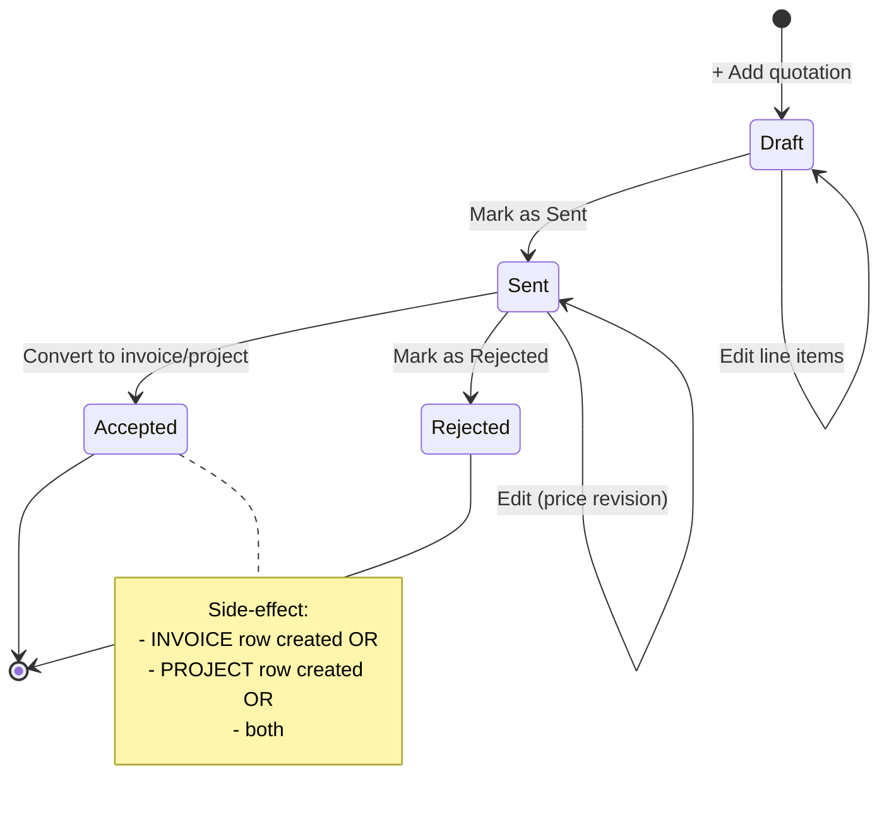

# Quotations

The proposal document. Records what you offered the customer, for how much,
and what they did with it. The pivot point between selling (CRM) and
delivering (Projects / Invoices).

## Purpose

A quotation is the **formal price commitment**. Auditors care about it
because the price the customer eventually pays should match (or be a
documented variance from) the price the approver authorised here.

## Personas

| Persona | What they do here |
|---|---|
| **Sales rep** | Drafts, tweaks line items, sends |
| **Sales Manager** | Approves discounts; reviews open proposals |
| **Project Manager** | Reads accepted quotes that spawn their projects |
| **Accountant** | Cross-references quotes against issued invoices |
| **Auditor** | Verifies invoiced amounts match quoted amounts |

## Quick reference

- **Number format**: vendor-configurable (default `Q-YYYY-NNNN`)
- **Status lifecycle**: `Draft → Sent → Accepted / Rejected`
- **Currency**: USD only (LBP at invoicing only)
- **Line items**: free-text name, quantity, unit price, optional tax rate
- **Tax**: per-line snapshot (tax rate, tax rate, tax amount)
- **Conversions**: → Invoice (one click), → Project (one click), → both
- **Attachable to**: a Client, a CRM Lead, or both
- **Soft delete + soft archive**: same pattern as Clients

---

=== "Operator's view"

    ### Creating a quotation

    1. Quotations → **+ Add quotation**
    2. Pick a Client (or a Lead if the contact isn't promoted yet)
    3. Set a project name — what you're proposing, in one line
    4. Add line items: name, qty, unit price, optional tax rate
    5. Save. Lands in status **Draft**.

    ### Sending

    Open the quote → **Mark as Sent**. Status moves from Draft to Sent and
    timestamps in the audit trail. The customer presumably gets a PDF or email
    from you outside the system (the PDF render is bundled but delivery is
    manual).

    ### When the customer accepts

    Two paths depending on what the work is.

    | Job size | Action | Result |
    |---|---|---|
    | Short, one-shot | **Convert to invoice** | Invoice created with same line items + tax. Quote status → Accepted. Money owed is now in A/R. |
    | Long, milestone-billed | **Convert to project** | Project created (status Active). You'll invoice milestones from the project later. Quote status → Accepted. |
    | Both | First **Convert to project**, then bill milestones | Project carries the budget; each milestone invoice references the project |

    Converting is safe to repeat — clicking "Convert to invoice"
    twice doesn't create two invoices; the second click jumps to the
    existing one.

    ### When the customer says no

    Open the quote → **Mark as Rejected** (with an optional reason in
    `notes`). Status → Rejected. The deal it was attached to should be
    marked Lost in CRM.

    ### Editing a sent quote

    Sent quotes are editable until they're either Accepted or Rejected. If
    the customer asks for a revised price, edit in place — the audit log
    captures both the original `total` and the new value.

    !!! tip "Versioning"
        For substantial revisions, **clone** the quote (Quotations → row
        menu → Clone) so the original stays as historical record. The
        clone starts Draft.

=== "Administrator's view"

    ### Permissions

    | Role | view | create | edit | delete | approve |
    |---|---|---|---|---|---|
    | Sales | ✅ | ✅ | ✅ | ✗ | ✗ |
    | Sales Manager | ✅ | ✅ | ✅ | ✅ | ✅ |
    | Project Manager | ✅ | ✗ | ✗ | ✗ | ✗ |
    | Accountant | ✅ | ✗ | ✗ | ✗ | ✗ |
    | Auditor | ✅ | ✗ | ✗ | ✗ | ✗ |

    `approve` is used by **approval policies** — e.g. "quotations with
    discount > 15% need Sales Manager approval before they can be sent".
    See Approvals (Phase 5).

    ### Numbering

    The quote number generator is centralised. The vendor configures the
    prefix in `vendor_config.py`; the sequence (NNNN) is per-year and
    resets each January.

    ### Tax engine

    Each line carries:
    - tax rate — FK to tax rates
    - tax rate — snapshot of the rate value at the time of write
    - tax amount — computed

    The snapshot means a tax rate change next year won't retroactively
    alter old quotes. See **Tax Rates** (Phase 4).

    ### Approval policies that gate sending

    A common policy: "Quotations with total > $10,000 need approval before
    converting to invoice". Configure in **Approval Policies**:
    - Module: quotations
    - Trigger action: `send` (or `convert`)
    - Condition: `total > 10000`
    - Approvers: `Sales Manager`

    See Approvals (Phase 5) for the policy engine.

=== "Auditor's view"

    ### The headline control — invoiced = quoted

    Each non-zero variance row needs an explanation: scope change?
    discount applied?

    ### Status integrity

    Result should be empty. Otherwise = a control gap: the quote says
    Accepted but no downstream document was produced.

    ### Conversion audit trail

    Every conversion writes an the audit trail row with
    `action='convert_to_invoice'` or convert to project.

---

## Status lifecycle

## What's NOT supported (deliberately)

- Multi-currency quotations. The system commits to one functional currency
  (USD) for sales documents.
- Partial accept. If the customer accepts 3 of 5 lines, you either edit
  the quote down to 3 then accept, or clone and trim.
- Negotiated revision history *inside* the same quote. Substantial
  revisions use Clone (so each version is its own auditable record).
