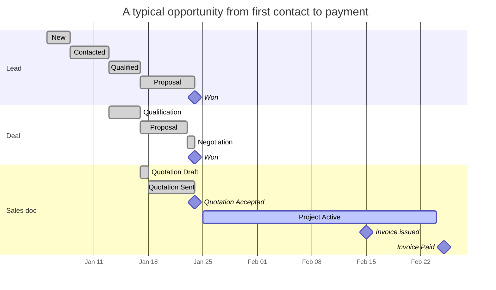

# Quote-to-cash workflow

The single most important diagram in the sales chapter. Once you understand
this end-to-end flow, the individual module pages slot into place.

## The full pipeline

```mermaid
flowchart TB
    subgraph PRE ["Inbound"]
        SRC[Lead source<br/>website · referral · cold call]
    end

    subgraph CRM ["CRM"]
        LEAD["Lead<br/>status: New → Contacted →<br/>Qualified → Proposal → Won/Lost"]
        DEAL["Deal<br/>stage: Qualification →<br/>Proposal → Negotiation → Won/Lost"]
        ACTIV[Activities<br/>calls, meetings, emails]
        CONT[Contacts]
    end

    subgraph SALES ["Sales documents"]
        QUO["Quotation<br/>status: Draft → Sent →<br/>Accepted / Rejected"]
        PRJ["Project<br/>status: Quotation Sent →<br/>Active → Invoiced → Completed"]
        INV["Invoice<br/>computed: Unpaid → Partial → Paid"]
    end

    subgraph CASH_FLOW ["Money in"]
        PAY[Payment]
        CASHD[Cash drawer]
        BANK[Bank deposit<br/>(non-cash methods)]
    end

    subgraph BOOKS ["Books of record"]
        GL[Journal entries:<br/>DR Cash CR Revenue]
        AGE[A/R aging]
    end

    SRC --> LEAD
    LEAD -->|convert| DEAL
    LEAD -.->|"Won → +client"| CLIENT[Client]
    LEAD -.->|note| ACTIV
    DEAL -->|attach| QUO
    QUO -->|"short job"| INV
    QUO -->|"long job"| PRJ
    PRJ -->|"milestone billing"| INV
    INV -->|tender| PAY
    PAY --> CASHD
    PAY --> BANK
    PAY --> GL
    INV --> AGE
    LEAD -.->|attach| CONT
    CLIENT -.->|attach| CONT

    style CRM fill:#fef3c7,stroke:#f59e0b
    style SALES fill:#dbeafe,stroke:#3b82f6
    style CASH_FLOW fill:#dcfce7,stroke:#10b981
    style BOOKS fill:#f1f5f9,stroke:#475569
```

The dotted edges are **optional** detours (a lead can win without a deal; a
quotation can become a direct invoice without a project). The solid edges
are the **canonical** path most opportunities take.

## Each conversion in detail

Six explicit conversions can happen along the pipeline. Each is one click,
one API call, one audit row.

| Conversion | From → To | API endpoint | What gets written |
|---|---|---|---|
| Lead → Client | Won lead promotes to customer master | `POST /api/crm/leads/{id}/convert` | New `clients` row, `crm_leads.client_id` set, status="Won" |
| Lead → Deal | Qualified lead opens a deal | `POST /api/crm/deals/` (with `lead_id`) | New `crm_deals` row, stage="Qualification" |
| Deal → Quotation | Proposal stage attaches a quote | `POST /api/quotations/` (with `client_id` from deal) | New `quotations` row; deal's `quotation_id` set |
| Quote → Invoice | Short job: bill straight from the quote | `POST /api/quotations/{id}/convert-to-invoice` | New `invoices` row with same line items + tax; quote.status="Accepted"; deal moves to "Won" |
| Quote → Project | Long job: spawn a project | `POST /api/quotations/{id}/convert-to-project` | New `projects` row, `source_quotation_id` linked, status="Active" |
| Project → Invoice | Milestone billing | `POST /api/invoices/` (with `project_id`) | New `invoices` row linked to the project |

Every conversion is **idempotent** at the source side — accepting a quote
twice doesn't create two invoices; the second click hits the existing
linkage.

## Status timelines



In practice deals and leads overlap — that's by design, since one captures
the **person** (lead) and the other captures the **opportunity value**
(deal). They share the lead source attribution but track different
KPIs.

## Where each module fits

| Module | Records the … | Tells you the … |
|---|---|---|
| [CRM](crm.md) | Funnel | Win-rate, pipeline value, source attribution |
| [Clients](clients.md) | Customer master | Lifetime value, every quote/invoice/project against them |
| [Quotations](quotations.md) | Proposal | What we said we'd deliver and for how much |
| [Projects](projects.md) | Delivery | Budget vs. actual, milestones, material consumption |
| [Invoices](invoices.md) | Billing | A/R aging, payment timing, currency mix |

## What auditors verify on this pipeline

Three control questions cover ~80% of sales-cycle audit work:

1. **Cut-off** — does every invoice posted in Period P actually relate to
   services delivered (or goods shipped) within P? `invoices.created_at`
   vs. `projects.completed_at` / linked `stock_movements.created_at`.
2. **Authorisation** — was the price the customer paid the price the
   approver authorised? Compare `quotations.total` vs. linked
   `invoices.amount` (a discount past quote = approval evidence required).
3. **Completeness** — every won deal should have either an invoice or a
   project. `crm_deals` with `stage='Won'` AND `quotation_id IS NULL` AND
   no linked invoice = a control gap to investigate.

The Auditor's view on each module page gives you the exact SQL.

## What's NOT in this chapter

The sales pipeline as defined here doesn't cover:

- **POS sales** — separate fast-path. See Operations → POS (Phase 3).
- **Recurring revenue / subscriptions** — modelled as recurring expenses
  in the Finance chapter, applied per-period.
- **Returns / RMAs** — POS handles its own returns; for invoiced returns,
  use the Void Invoice action (creates a documented reversal).
