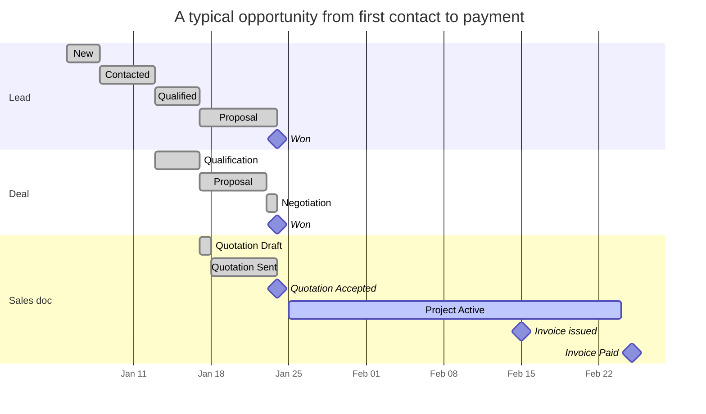

# Quote-to-cash workflow

The single most important diagram in the sales chapter. Once you understand
this end-to-end flow, the individual module pages slot into place.

## Each conversion in detail

Six conversions can happen along the pipeline. Each is one click, and each
leaves a trail so you can see later where a record came from.

| Conversion | When you use it | Where |
|---|---|---|
| Lead → Client | The lead is won and becomes a real customer | CRM → the lead → **Convert** |
| Lead → Deal | The lead is qualified and you want to track the opportunity | CRM → the lead → **New deal** |
| Deal → Quotation | You are ready to propose a price | Quotations → **+ Add quotation** |
| Quote → Invoice | Short job — bill straight from the quote | Quotations → the quote → **Convert to Invoice** |
| Quote → Project | Long job — set up the work first | Quotations → the quote → **Convert to Project** |
| Project → Invoice | Milestone billing on a long job | Invoices → **+ Add invoice**, pick the project |

Nothing is retyped: line items, prices and tax carry across, and the new
record stays linked to the one it came from.

Converting never duplicates — accepting a quote
twice doesn't create two invoices; the second click hits the existing
linkage.

## Status timelines

In practice deals and leads overlap — that's by design, since one captures
the **person** (lead) and the other captures the **opportunity value**
(deal). They share the lead source attribution but track different
KPIs.

## Where each module fits

| Module | Records the … | Tells you the … |
|---|---|---|
| [CRM](crm.md) | Funnel | Win-rate, pipeline value, source attribution |
| [Clients](clients.md) | Customer master | Lifetime value, every quote/invoice/project against them |
| [Quotations](quotations.md) | Proposal | What we said we'd deliver and for how much |
| [Projects](projects.md) | Delivery | Budget vs. actual, milestones, material consumption |
| [Invoices](invoices.md) | Billing | A/R aging, payment timing, currency mix |

## What auditors verify on this pipeline

Three control questions cover ~80% of sales-cycle audit work:

1. **Cut-off** — does every invoice posted in Period P actually relate to
   services delivered (or goods shipped) within P? `invoices.created_at`
   vs. `projects.completed_at` / linked `stock_movements.created_at`.
2. **Authorisation** — was the price the customer paid the price the
   approver authorised? Compare `quotations.total` vs. linked
   `invoices.amount` (a discount past quote = approval evidence required).
3. **Completeness** — every won deal should have either an invoice or a
   project. deals with `stage='Won'` AND `quotation_id IS NULL` AND
   no linked invoice = a control gap to investigate.

The Auditor's view on each module page gives you the exact SQL.

## What's NOT in this chapter

The sales pipeline as defined here doesn't cover:

- **POS sales** — separate fast-path. See Operations → POS (Phase 3).
- **Recurring revenue / subscriptions** — modelled as recurring expenses
  in the Finance chapter, applied per-period.
- **Returns / RMAs** — POS handles its own returns; for invoiced returns,
  use the Void Invoice action (creates a documented reversal).
